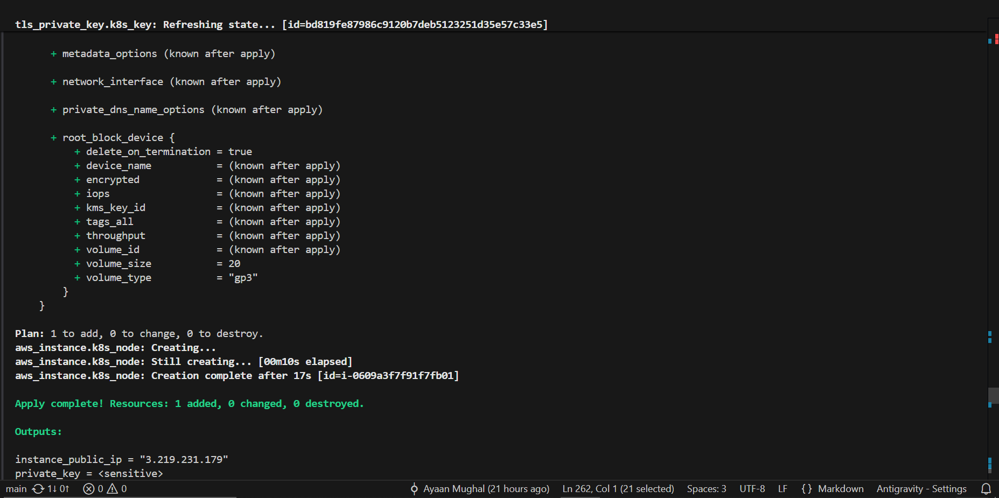
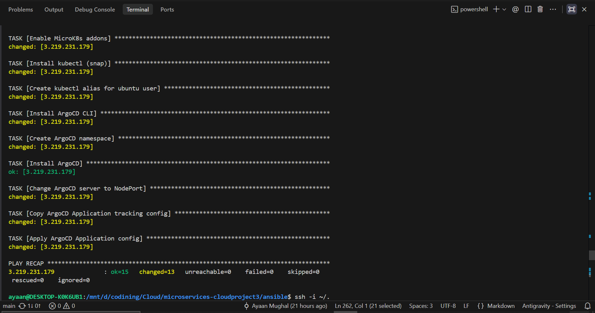
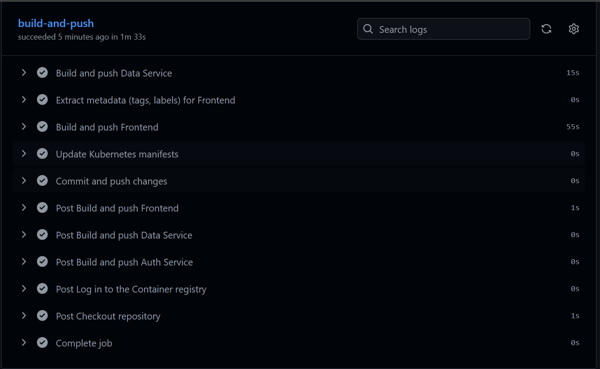
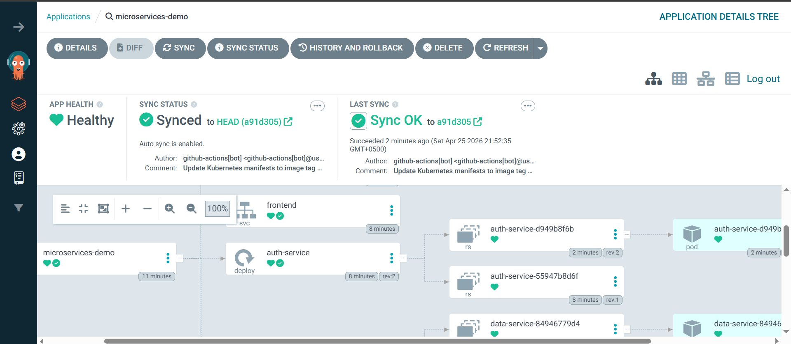
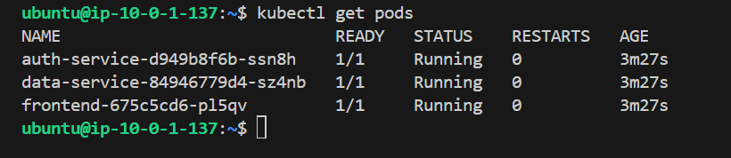
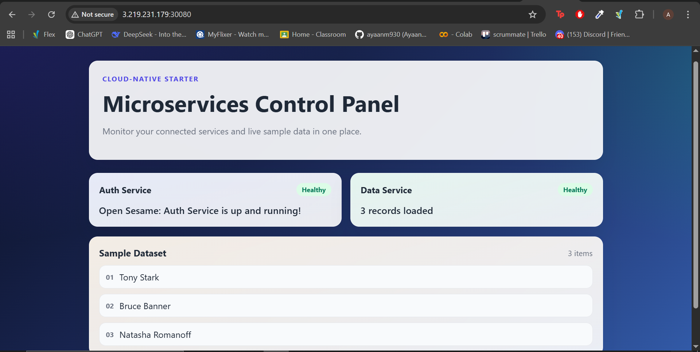

# Cloud Computing Project 3: Multi-Tier Application Deployment
## Section A
- Mishal Ali 22i-1291
- Ayaan Mughal 22i-0861

---

## Overview

In this project, we have architected a complete deployment pipeline for a microservices-based application (React + Node.js + FastAPI). The application is deployed onto an AWS EC2 instance using industry-standard tools for Infrastructure as Code (IaC), configuration management, containerization, and Continuous Deployment (CD).

Public Project Used: https://github.com/nuelStarkOps/microservices-demo.git

## Project Goal

The objective is to deploy the codebase on an Amazon EC2 instance such that the application is fully functional, highly available, and accessible to external users. 

## Methodology & Artifacts

The project is structured according to the following deployment flow:

### 1. Containerization (Docker)
- **Dockerfile:** A unique `Dockerfile` has been written for every microservice (`frontend`, `auth-service`, `backend-service`) in the codebase to enable automated image building.

### 2. Infrastructure as Code (Terraform)
- **AWS Provisioning:** Terraform is used to provision the target EC2 instance (`t3.medium`) within the AWS account.
- **Networking & Security:** The Terraform configuration includes necessary supporting resources, such as a custom VPC, Subnets, Internet Gateway, and Security Groups, ensuring secure connectivity and exposing required ports.

### 3. Configuration as Code (Ansible)
- **Node Setup:** An Ansible playbook (`ansible/playbook.yml`) completely configures the provisioned EC2 instance.
- **Cluster Initialization:** The configuration automatically prepares the machine to run a local Kubernetes cluster (MicroK8s), sets up user permissions, and installs ArgoCD.

### 4. Cluster (Kubernetes Manifests)
- **Resource Definitions:** Kubernetes `Service` and `Deployment` manifests are written for every microservice inside the `k8s/` directory.
- **Integration:** The deployment manifests natively utilize the Docker images created in the CI step, exposing the frontend via a NodePort.

### 5. CI/CD Pipeline (GitHub Actions & ArgoCD)
- **CI Workflow:** A GitHub Actions workflow (`.github/workflows/deploy.yml`) is implemented to trigger on codebase changes to the `main` branch. It automatically rebuilds the Docker images and dynamically updates the Kubernetes manifests with the new image tags.
- **CD Synchronization:** ArgoCD is configured on the cluster to constantly monitor the repository and automatically sync the Kubernetes cluster with the updated manifests in the `k8s/` folder.

---

## Deliverables Provided
1. **Source Code:** Complete application code, Dockerfiles, and Kubernetes YAML files.
2. **Infrastructure Code:** All `.tf` (Terraform) and `.yml` (Ansible) files.
3. **CI/CD Config:** The GitHub Actions workflow and ArgoCD application configuration.
4. **Documentation:** This comprehensive README detailing deployment steps and evidence.

---

## Architecture Diagram

```text
                                  [ GitHub Repository ]
                                           │ (Push to main)
                                           ▼
                                 [ GitHub Actions (CI) ]
                                           │ (Build & Push Images)
                                           ▼
                               [ GitHub Container Registry ]
                                           │
                                           │ (ArgoCD Pulls & Syncs)
                                           ▼
┌────────────────────────────── AWS EC2 Instance (t3.medium) ──────────────────────────┐
│                                                                                      │
│  ┌──────────────────────────── Kubernetes Cluster (MicroK8s) ─────────────────────┐  │
│  │                                                                                │  │
│  │  [ ArgoCD ] <--- Monitors GitHub k8s/ manifests                                │  │
│  │                                                                                │  │
│  │           ┌──────────────┐         ┌────────────────┐         ┌──────────────┐ │  │
│  │           │  Frontend    │ <-----> │  Auth Service  │ <-----> │  Backend     │ │  │
│  │           │  (React)     │         │  (Node.js)     │         │  (FastAPI)   │ │  │
│  │           └──────┬───────┘         └────────────────┘         └──────────────┘ │  │
│  │                  │ (NodePort 30080)                                            │  │
│  └──────────────────┼─────────────────────────────────────────────────────────────┘  │
└─────────────────────┼────────────────────────────────────────────────────────────────┘
                      │
               [ External User ]
```

Each service runs independently in its own Kubernetes Pod — communicating over the internal cluster network, while the entire deployment lifecycle is fully automated via GitOps.

---

## 🚀 Deployment on AWS EC2 with K8s/ ansible & terraform

Follow these exact commands to provision, configure, and deploy the application from scratch. (Make sure terraform.tfvars exists and contains AWS credentials)

### Step 1: Provision Infrastructure (Terraform)
Create the AWS EC2 instance, VPC, and Security Groups.
```bash
cd terraform
terraform init
terraform apply -auto-approve
```

**2. Configure the Node with Ansible:**
Save the output private key to a file (e.g. `k8s_key.pem`), set correct permissions (`chmod 400 k8s_key.pem`), and run the Ansible playbook to install MicroK8s and ArgoCD:
```bash
# Run this inside your WSL terminal:
cmd.exe /c "terraform output -raw private_key > k8s_key.pem"
cp k8s_key.pem ~/.ssh/k8s_key.pem
chmod 400 ~/.ssh/k8s_key.pem
```

### Step 2: Configure the Cluster (Ansible)
Run the Ansible playbook to install MicroK8s, install ArgoCD, and automatically apply the ArgoCD GitHub-tracker application.
```bash
cd ../ansible
ansible-playbook -i "<EC2_PUBLIC_IP>," -u ubuntu --private-key ~/.ssh/k8s_key.pem playbook.yml
```

### Step 3: Retrieve ArgoCD Credentials
Log into the EC2 server and retrieve the auto-generated ArgoCD administrator password:
```bash
ssh -i ~/.ssh/k8s_key.pem ubuntu@3.219.231.179
sudo microk8s kubectl -n argocd get secret argocd-initial-admin-secret -o jsonpath="{.data.password}" | base64 -d; echo
exit
```

### Step 4: Trigger the CI/CD Pipeline
Commit and push all code changes to the `main` branch. This tells GitHub Actions to build the Docker containers and update the manifests, which ArgoCD will instantly detect and deploy!
```bash
git add .
git commit -m "Triggering pipeline deployment"
git push origin main
```
### URLs
Frontend: http://<EC2_PUBLIC_IP>:30080

ArgoCD: https://<EC2_PUBLIC_IP>:30443

#### View K8s cluster
```bash
ssh -i ~/.ssh/k8s_key.pem ubuntu@<EC2_PUBLIC_IP>
sudo microk8s kubectl get pods
```

---

## Evidence of Working Deployment

### 1. Terraform Infrastructure Deployed


### 2. Ansible Playbook Execution


### 3. GitHub Actions CI Pipeline Success


### 4. ArgoCD Dashboard & Synchronization


### 5. Running Kubernetes Pods


### 6. Live Application Frontend

